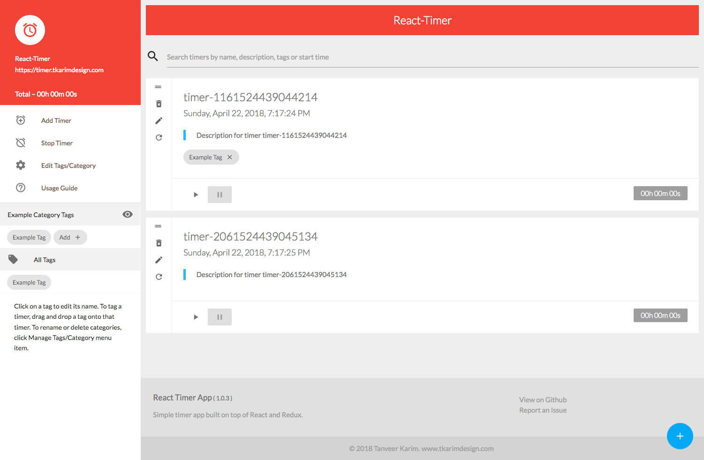

# React Timer App [](https://travis-ci.org/tanmancan/react-timer-app)




Simple timer app built on top of React and Redux. Leverages localStorage and service worker to allow timer to work offline and persist data when reloading page.

[timer.tkarimdesign.com](https://timer.tkarimdesign.com)

### Usage Guide

https://timer.tkarimdesign.com/#usage-guide

### Run locally

Clone to local directory, then

```shell
$ cd path/to/repo
$ npm run start

# Visit http://localhost:3000 on a browser to use locally.
```

&copy; Tanveer Karim
